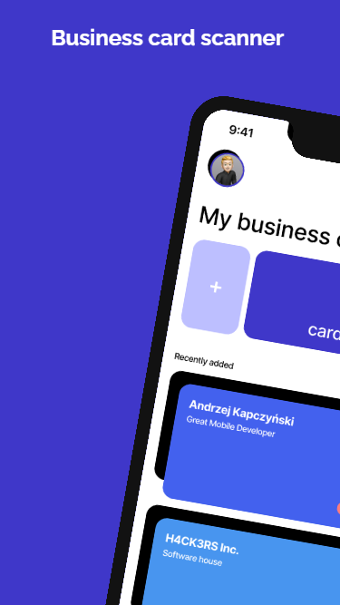
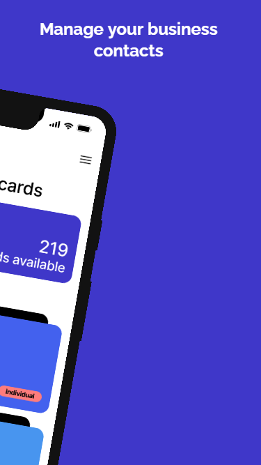
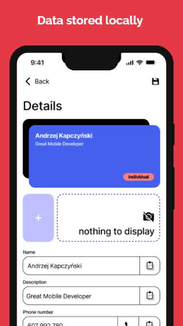
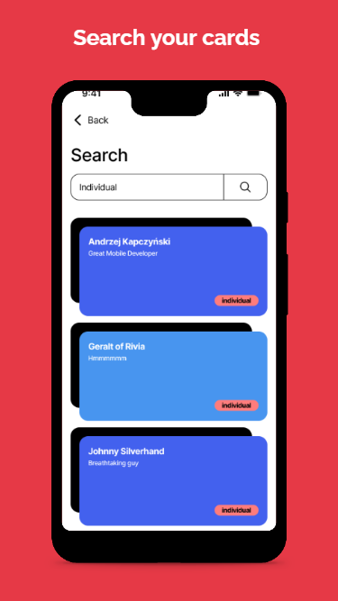
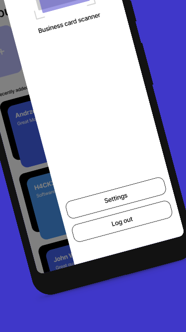
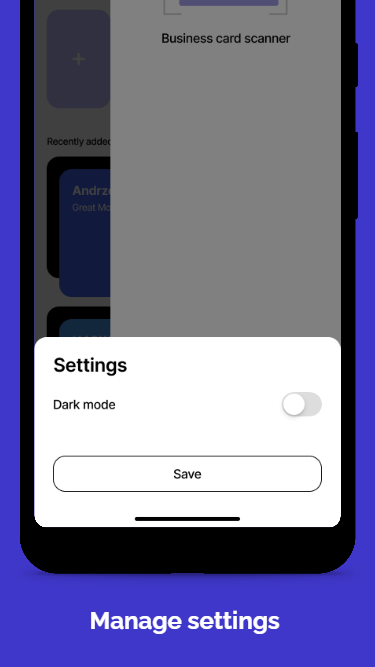

# Business Card Scanner

<table>
  <tr>
    <td></td>
    <td></td>
    <td></td>
  </tr>
  <tr>
    <td></td>
    <td></td>
    <td></td>
  </tr>
</table>

## Overview
The Business Card Scanner is a mobile application designed to streamline the process of managing and organizing business cards. With this app, users can effortlessly digitize their collection of business cards, store them securely, and easily access the information whenever needed. 

## MVP Version
Please note that this repository contains the Minimum Viable Product (MVP) version of the Business Card Scanner app. The full version with additional features and improvements can be downloaded on Google Play.

## Design
The user interface and experience design of the Business Card Scanner is available on [Figma](https://www.figma.com/file/HvznxP0UFFemlnwuCDedia/Business-cars-scanner?type=design&mode=design&t=pj0RZbzJqRokMlk3-1).
